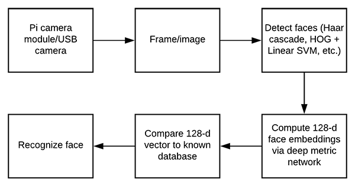

# Face recognition

See this blog post for an in-depth walkthrough: https://medium.com/data-science-lab-amsterdam/face-recognition-with-python-in-an-hour-or-two-d271324cbeb3


The facial recognition works roughly as follows:



* Webcam provides an image
* A face detection algorithm (HOG) detects where in the image a face is located
* This part of the image is cut out and serves an input to the model
* The model is a (modified) ResNet CNN encoding the input to a feature vector of length 128
* We have a small database with feature vectors of portraits or our DSL colleagues
* The best match is found using a simple distance metric between the feature vectors

## Installation
* Create an environment and install the requirements.
  <br>N.B. Before installing dlib you need to have some other stuff installed. See https://www.pyimagesearch.com/2018/01/22/install-dlib-easy-complete-guide/
* git clone the repo
* Put one picture of each person of interest in the ./images folder

### Running
There are various ways to run the scripts:
* ```python src/main-webcam-simple.py```
  <br>Shows the image in a separate window. Cleanest and most simnple version. Not recommended for performance.
  <br>*N.B. The camera window doesn't close on a Mac due to some OpenCV bug!*
* ```python src/main-advanced.py -d -s```
  <br>The ```-d``` enables a video window
  <br>The ```-s``` enables sound
  <br>The ```-n``` enables network camera as video source (if you've supplied the right url in the configuration)
* ```python src/dash-app.py```
  <br>For a nice dashboard, accessible via http://127.0.0.1:8234/

